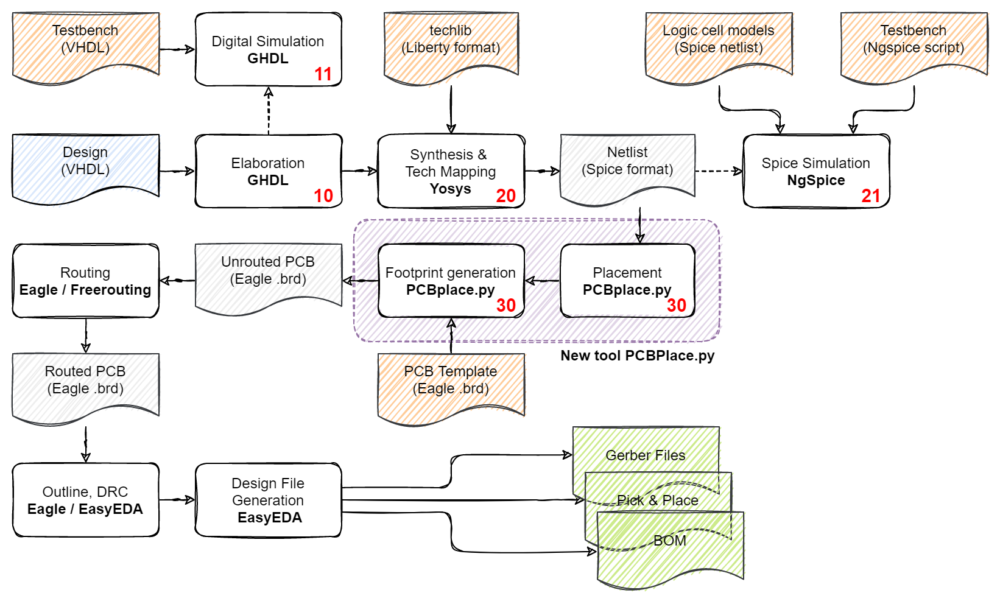
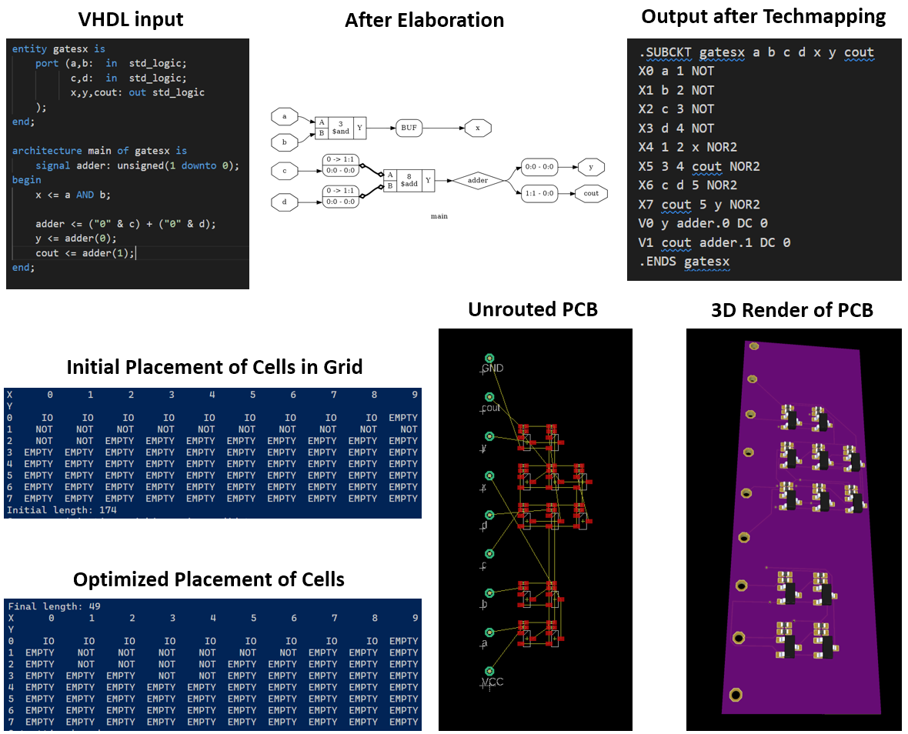

# VHDL to OCF format conversor


Design haskell programs, convert to vhdl , and converto to optical circuit cnc laser printing.

## Abstract

Optical logic gates are developed since more than 15 years ago, the main propouse of this paper is develop a cheap real optical 32 bit procesor, and hardware conversor for design circuit over dialetric metal crystals .

Conververting standard haskell to VHDL we have a easy way to design circuits, using OCF conversor we can print the circuits over cristals in each low cost CO2 CNC laser machine .

```mermaid

HASKELL --> VHDL ;
VHDL --> OCF;

```

## Materials


## VHDL to OCF conversion

OCF is and SVG format file composet by refraction desgins in diferent rotation grades to compose AND, EOR, OR, NOR logic states and Clock signal. 


## Optical Gates

Read 

https://www.osapublishing.org/oe/fulltext.cfm?uri=oe-28-12-18317&id=432364

https://pubs.acs.org/doi/10.1021/acsphotonics.7b01566

## Layers


## Install

`chmod +x install && ./install`

## Usage

`./ovhdlcf file_in.vhdl file_out.ocf`
# Flow Architecture



The diagram above shows how the individual steps of the flow are connected. The starting point is the design (A VHDL source file) in the blue file box. In subsequent steps, this design will be transformed by various tools into new intermediate representations (grey). To aid this, technology description files and testbenches are needed (orange). The output at the end of the flow are the three green files, which describe the PCB layout (Gerber), the part list (BOM) and where the parts have to be placed on the PCB (Pick & Place).

At the core of the flow is PCBPlace.py, which is a placement and footprint generation tool written in Python. The remaining steps are covered by existing Open-Source or freely accessible Tools.

Right now, everything is based on shell scripts that have to be invoked manually. The numbers in the process boxes indicate the number of the script that performs this step. Scripts ending on zero (10,20,30) are mandatory steps for the flow, scripts ending on other digits are optional, e.g. for intermediate simulation.

The technology description files and additional data reside in subfolders [10_HDL](10_HDL/), [20_SYNTH](20_SYNTH/), [30_PLACE](30_PLACE/). [10_HDL](10_HDL/) also holds the design files. All intermediate and output files are stored in the [Work](Work/) folder. It can be cleaned by calling the "clean_all.sh" script.

The output of the automated part of the flow is an unrouted PCB. Routing and design file generation has to be invoked manually with the indicated tools. Please be aware that the placement tool is in a very early experimental stage. Constants in the code may have to be tuned for better results depending on input design.

# Examples

The image below shows a basic example, implementing a full adder and an AND gate, going from source code via intermediate representations to the final 3D rendered PCB.




## Optic 32 bit microprocessor


## Donations


## Authors

Citrix

Hecatomb


Forked From https://github.com/cpldcpu/PCBFlow

